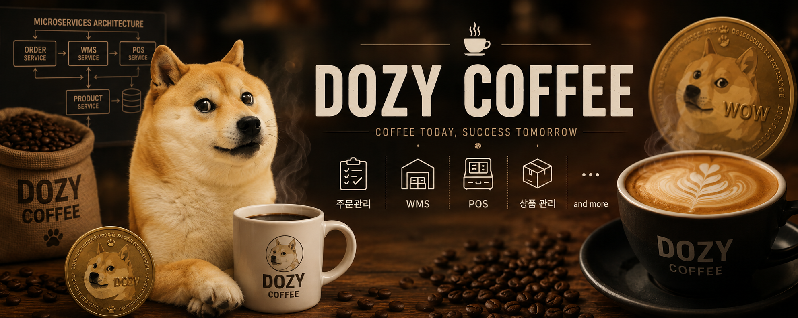

## 목차

1. [프로젝트 소개](#1-프로젝트-소개)
2. [프로젝트 목표](#2-프로젝트-목표)
3. [기술 스택](#3-기술-스택)
4. [ERD](#4-erd)
5. [프로젝트 폴더 구조](#5-프로젝트-폴더-구조)
6. [실행 방법](#6-실행-방법)

<br>

## 1. 프로젝트 소개



본 프로젝트는 커피 프랜차이즈 **DOZY COFFEE**를 위한 카페 원부자재 창고 관리 시스템(WMS) 백엔드 API 서버입니다.

원두, 부자재, 포장재 등 카페 운영에 필요한 재고를 체계적으로 관리하며, 입고·출고·반품·폐기·재고 실사·유통기한 모니터링 등 창고 운영 전반을 지원합니다.

<br>

## 2. 프로젝트 목표

- FIFO 기반 재고 소진 규칙 자동 적용으로 재고 낭비 최소화
- 유통기한 임박 재고 사전 감지 및 알림으로 폐기 손실 방지
- 창고 용량(Capacity) 초과 방지 및 적정 재고 수준 유지
- Spring WebFlux + R2DBC를 활용한 논블로킹 리액티브 아키텍처 설계 경험

<br>

## 3. 기술 스택

### Backend

| 분류 | 기술 |
|------|------|
| Language | Java 21 |
| Framework | Spring Boot 4.1.0 |
| Web | Spring WebFlux |
| DB Access | Spring Data R2DBC |
| Validation | Spring Validation |
| Build | Gradle |

<br>

## 4. ERD

> ERD 이미지

<br>

## 5. 프로젝트 폴더 구조

```
src
├── main
│   ├── java/com/dozycoffee/inventory
│   │   ├── global                            // 전역 설정 및 공통 모듈
│   │   │   ├── common                        // BaseEntity
│   │   │   ├── config                        // SecurityConfig
│   │   │   ├── error                         // ErrorCode, BusinessException, GlobalExceptionHandler
│   │   │   └── event                         // 도메인 이벤트 정의 및 발행 (EventPublisher)
│   │   │
│   │   ├── warehouse                         // 창고(Warehouse) · 구역(Zone) · 위치(Location)
│   │   ├── product                           // 상품 마스터
│   │   ├── inventory                         // 재고 관리 · Lot
│   │   ├── inbound                           // 입고 관리
│   │   ├── inspection                        // 품질 검사
│   │   ├── outbound                          // 출고 관리
│   │   ├── disposal                          // 폐기 관리
│   │   └── return_request                    // 반품 관리
│   │
│   │   # 각 도메인의 내부 구조
│   │   └── {domain}
│   │       ├── adapter
│   │       │   ├── in
│   │       │   │   ├── web                   // REST Controller, Request/Response DTO
│   │       │   │   └── event                 // 도메인 이벤트 수신 어댑터
│   │       │   └── out
│   │       │       └── persistence
│   │       │
│   │       ├── application
│   │       │   ├── port
│   │       │   │   ├── in                    // UseCase 인터페이스, Command, Result
│   │       │   │   └── out                   // Port 인터페이스
│   │       │   └── service                   // 애플리케이션 서비스 (UseCase 구현체)
│   │       │
│   │       └── domain
│   │           ├── model                     // 도메인 모델 (순수 POJO)
│   │           ├── enums                     // 도메인 열거형
│   │           ├── exception                 // 도메인 예외 및 에러 코드
│   │           ├── valueobject               // 값 객체
│   │           └── service                   // 도메인 서비스
│   │
│   └── resources
│       ├── application.properties            // 환경 설정
│       └── static/docs                       // 생성된 OpenAPI 스펙 (Swagger UI 서빙)
│
└── test
    └── java/com/dozycoffee/inventory
        ├── global
        │    └── restdocs                     // RestDocsSupport (Controller 테스트 베이스 클래스)
        ├── warehouse
        ├── product
        ├── inventory
        ├── ...
        └── */fixture                         // 테스트 픽스처 빌더
```

<br>

## 6. 실행 방법

### 사전 요구사항

- JDK 21 이상
- Gradle 9.x 이상 (또는 `gradlew` Wrapper 사용)

### 빌드 및 실행

```bash
# 빌드
./gradlew build

# 실행
./gradlew bootRun
```

### 환경 변수 설정

`src/main/resources/application.properties` 또는 `application.yml`에 DB 연결 정보를 설정합니다.

```properties
spring.r2dbc.url=r2dbc:postgresql://localhost:5432/dozy_inventory
spring.r2dbc.username=your_username
spring.r2dbc.password=your_password
```
